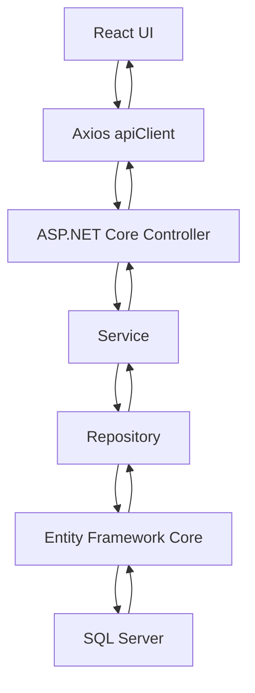
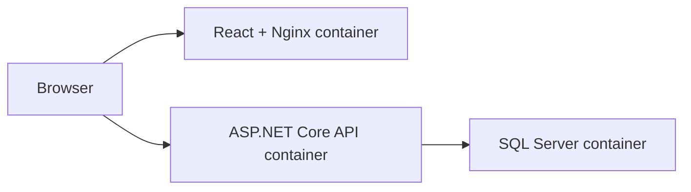

# EmployeeHub Demo Project

EmployeeHub Demo is a small employee management application built to teach ASP.NET Core, React, Docker, and GitHub Actions through a complete CI/CD workflow.

The goal is not production complexity. The goal is a clear project that a beginner can understand, run, test, containerize, and explain in a CI/CD presentation.

## 1. Project Overview CI/CD

EmployeeHub Demo contains:

- ASP.NET Core 9 Web API backend
- React, TypeScript, Vite, Tailwind CSS frontend
- SQL Server database through Entity Framework Core
- Simple JWT authentication
- xUnit backend tests
- Vitest frontend tests
- Dockerfiles for backend and frontend
- Docker Compose for frontend, backend, and SQL Server
- GitHub Actions workflow for CI/CD

Seeded Docker login:

```text
Email: admin@employeehub.local
Password: Admin@123
```

## 2. Architecture Diagram



## 3. Folder Structure

```text
Employee Hub/
├── .github/workflows/ci-cd.yml
├── backend/
│   ├── Controllers/
│   ├── Data/
│   ├── DTOs/
│   ├── Models/
│   ├── Repositories/
│   ├── Services/
│   ├── Dockerfile
│   └── Program.cs
├── backend.Tests/
├── frontend/
│   ├── src/
│   │   ├── api/
│   │   ├── components/
│   │   ├── hooks/
│   │   ├── pages/
│   │   ├── services/
│   │   └── types/
│   ├── Dockerfile
│   └── nginx.conf
├── docs/
├── docker-compose.yml
└── EmployeeHubDemo.slnx
```

## 4. Backend Flow

The backend follows this pattern:

```text
Controller -> Service -> Repository -> Entity Framework Core -> SQL Server
```

Example:

`EmployeesController` receives `GET /api/employees`, calls `EmployeeService`, and the service calls `EmployeeRepository`. The repository uses `AppDbContext` to query SQL Server.

## 5. Frontend Flow

The frontend follows this pattern:

```text
Page Component -> Service Function -> Axios apiClient -> ASP.NET Core API
```

Example:

`DashboardPage.tsx` calls `employeeService.getEmployees(search)`. That service uses `apiClient`, which sends an HTTP request to the backend.

## 6. Database Flow

Entity Framework Core maps C# classes to SQL Server tables:

- `Employee.cs` becomes the Employees table
- `User.cs` becomes the Users table
- `AppDbContext.cs` exposes those tables through `DbSet`
- `DatabaseInitializer.cs` seeds demo data when the database is empty

## 7. API Endpoints

Authentication:

```text
POST /api/auth/register
POST /api/auth/login
```

Employees:

```text
GET    /api/employees?search=value
GET    /api/employees/{id}
POST   /api/employees
PUT    /api/employees/{id}
DELETE /api/employees/{id}
GET    /api/employees/dashboard
```

Health:

```text
GET /health
```

## 8. Docker Architecture

Docker Compose starts three containers:



The Docker frontend runs on `http://localhost:5174`.

The backend runs on `http://localhost:5217`.

SQL Server runs on `localhost:1433`.

## 9. GitHub Actions Workflow

The workflow file is:

```text
.github/workflows/ci-cd.yml
```

It runs when code is pushed to `main` or when a pull request targets `main`.

## 10. CI Pipeline Explanation

CI means Continuous Integration.

In this project, CI does this:

1. Checkout repository
2. Setup .NET 9
3. Restore NuGet packages
4. Build backend
5. Run backend tests
6. Setup Node.js
7. Install frontend packages
8. Run frontend tests
9. Build React app
10. Build Docker images

If any step fails, GitHub marks the workflow as failed.

## 11. CD Pipeline Explanation

CD means Continuous Delivery in this demo.

The workflow does not deploy to a live server. Instead, it prepares deployable artifacts:

- Published ASP.NET Core backend files
- Built React static files
- Verified Docker images

That is enough for a presentation because it shows how build outputs become deployable packages.

## 12. How Docker Compose Works

Run:

```powershell
docker compose up --build
```

Docker Compose will:

1. Pull SQL Server image
2. Build backend image
3. Build frontend image
4. Start SQL Server
5. Start ASP.NET Core API
6. Start React frontend
7. Let the API create and seed the database

## 13. How to Run the Project

With Docker:

```powershell
docker compose up --build
```

Open:

```text
http://localhost:5174
```

Backend Swagger:

```text
http://localhost:5217/swagger
```

Local frontend only:

```powershell
cd frontend
npm install
npm run dev
```

Local backend build:

```powershell
dotnet restore backend/EmployeeHub.Api.csproj
dotnet build backend/EmployeeHub.Api.csproj
```

## 14. How to Push Changes

```powershell
git add .
git commit -m "Complete EmployeeHub demo"
git push origin main
```

## 15. What Happens After git push

After `git push origin main`:

1. GitHub detects the push
2. GitHub Actions starts the workflow
3. Backend restore/build/test runs
4. Frontend install/test/build runs
5. Docker images are built
6. Artifacts are uploaded
7. The workflow result becomes pass or fail

## 16. Beginner Guide to ASP.NET Core

ASP.NET Core is the backend web framework.

Important files:

- `Program.cs`: configures the application
- Controllers: receive HTTP requests
- Services: contain business rules
- Repositories: talk to the database
- DTOs: shape request and response data
- Models: represent database tables

## 17. Beginner Guide to React Structure

React is the frontend UI library.

Important folders:

- `pages`: full screens
- `components`: reusable UI pieces
- `services`: API calls
- `api`: shared Axios setup
- `hooks`: reusable React state logic
- `types`: TypeScript data shapes

## 18. Beginner Guide to Docker

Docker packages applications into containers.

This project uses:

- Backend Dockerfile for ASP.NET Core
- Frontend Dockerfile for React + Nginx
- Docker Compose to run frontend, backend, and SQL Server together

## 19. Beginner Guide to GitHub Actions

GitHub Actions runs automation in GitHub.

This project uses it to prove:

- The backend builds
- Backend tests pass
- The frontend builds
- Frontend tests pass
- Docker images can be created
- Build artifacts can be uploaded

## Local .NET Runtime Note

This project targets `net9.0`.

This machine currently has .NET 8 and .NET 10 runtimes installed. Backend build works. To run backend tests locally without installing .NET 9, use:

```powershell
$env:DOTNET_ROLL_FORWARD='Major'
dotnet test backend.Tests/EmployeeHub.Api.Tests.csproj --no-build
```

GitHub Actions installs .NET 9 automatically.
