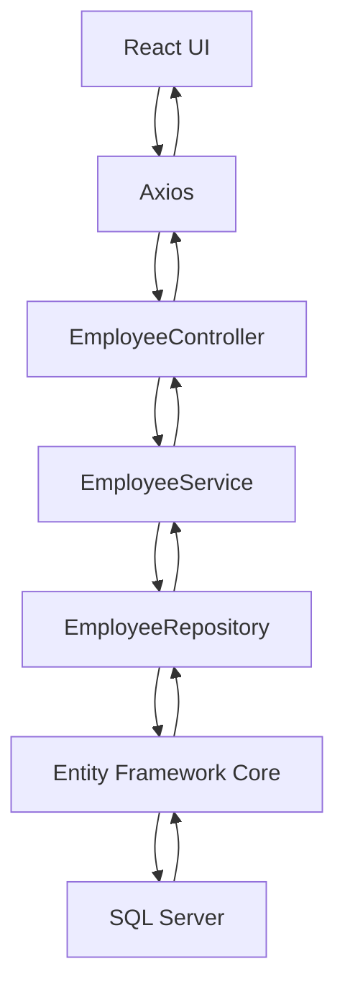

# Request Flow

This is the main learning path for the project.

## Example: Search Employee

1. User types a search term in React
2. `DashboardPage.tsx` calls `employeeService.getEmployees(search)`
3. `employeeService.ts` uses Axios
4. Axios sends `GET /api/employees?search=value`
5. `EmployeesController.cs` receives the request
6. `EmployeeService.cs` applies business flow
7. `EmployeeRepository.cs` queries SQL Server through EF Core
8. SQL Server returns matching rows
9. The API returns JSON
10. React updates the table
